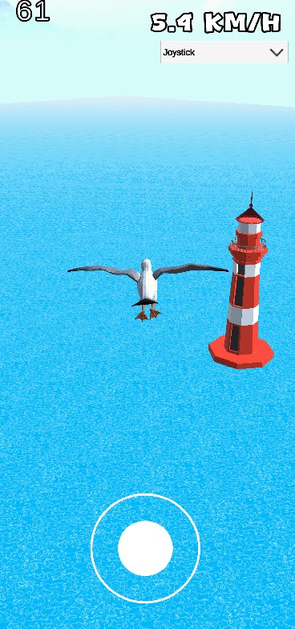

# 🐦 Hungry Seagull  

**Hungry Seagull** is a relaxing and fun **casual mobile game**.  
Soar freely above the sea with your seagull, dive, and catch fish with smooth animations!  

## 🎮 Gameplay  
- Control the seagull and glide through the sky.  
- Experience realistic flight thanks to the custom **gravity and physics system**.  
- During a fish-catching sequence, the camera switches to a cinematic view:  
  - The seagull glides, speeds up, and dives into the water.  
  - At the last moment, wings spread and the beak animation plays as the fish is caught.  
- Combined with ocean waves and atmosphere, it creates a cinematic experience.  

## 🌊 Features  
- Realistic seagull flight physics  
- Multiple seagull animations  
- Cinematic fish-catching sequences  
- Detailed **ocean shader** and atmosphere  

## 🎮 Control Options  
Choose your preferred play style from the dropdown in the settings:  
1. **Virtual Joystick**  
2. **Joystick + Speed Button**  
3. **Phone Rotation + Speed Button**  

## 📱 Platform  
Mobile  

## 🖼️ Screenshots  
> In-game screenshots

  
  
  
  
  

---

## 🛠️ Tech Stack  
- Unity (URP)  
- C#  
- Custom Physics & Shader  
- Mobile Controller Support 
